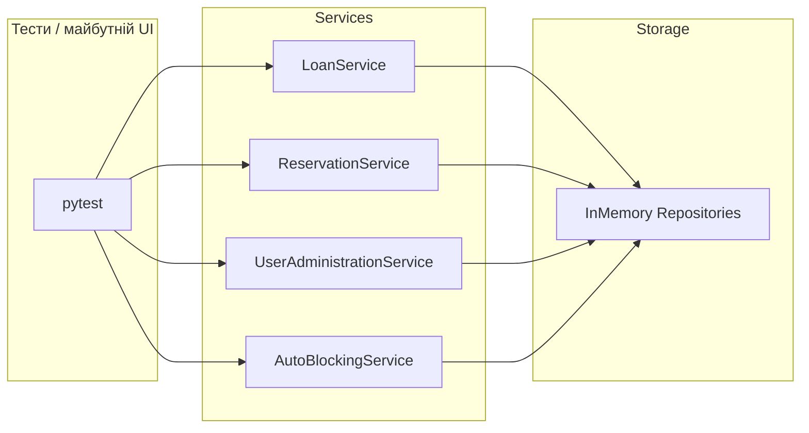

# Архітектура: in-memory бібліотека

## Мета

Імітація бібліотечної системи з **читачами** та **бібліотекарями**, обліком примірників книг, **позиками**, **чергою резерву** та **політикою штрафів** — усе в оперативній пам’яті через репозиторії за `Protocol`.

## Шари

1. **`src/models`** — незмінні/прості структури даних: `User`, `Book`, `Loan`, `Reservation`, переліки `Role`, `BookCategory`, `LoanState`.
2. **`src/storage/protocols.py`** — контракти `IUserRepository`, `IBookRepository`, `ILoanRepository`, `IReservationRepository`.
3. **`src/storage/in_memory.py`** — реалізації на словниках і списках; без I/O.
4. **`src/services`** — сценарії:
   - `loan_service.py` — видача/повернення, обчислення прострочення, виклик **Strategy** штрафів, публікація події доступності через **Subject**.
   - `reservation_service.py` — постановка в чергу, скасування, **Observer** для “наступного в черзі”.
   - `user_administration.py` — блокування читача бібліотекарем.
   - `auto_blocking.py` + `blocking_policy.py` — автоматичне блокування за правилами після великої заборгованості.
5. **`src/patterns`** — GoF: `penalty_strategy.py`, `observer.py`.
6. **`src/utils`** — чисті функції для дат (календарні дні прострочення).

## Інверсія залежностей

Сервіси приймають **інтерфейси** репозиторіїв і стратегій (через типізацію `Protocol`), а тести підставляють in-memory реалізації або mock-об’єкти.

## Потік (спрощено)

