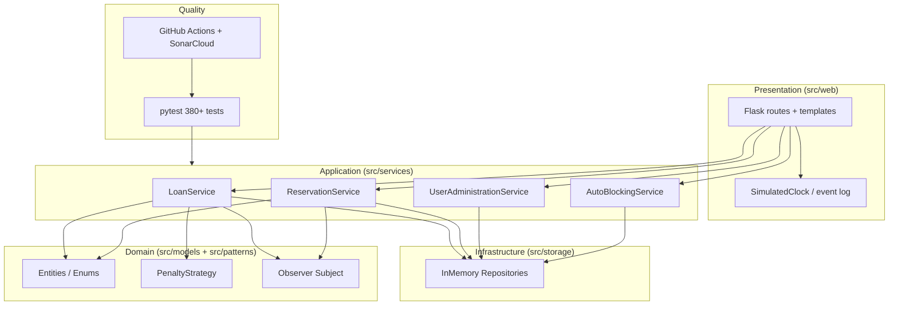
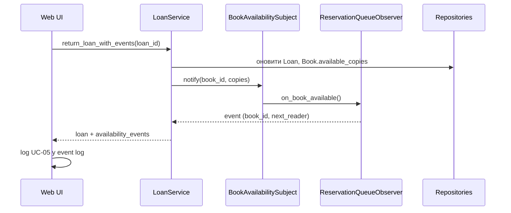

# Архітектура шарів

## Діаграма компонентів

## Потік: повернення книги з чергою резерву

## Принципи

- **SOLID:** сервіси залежать від абстракцій (`Protocol`), не від реалізацій.
- **Thin web layer:** маршрути делегують у `LoanService` / helpers; без бізнес-логіки в Jinja.
- **In-memory only:** без зовнішніх БД і HTTP API в домені.
- **Testability:** mock-репозиторії, параметризовані матриці штрафів і блокувань.
