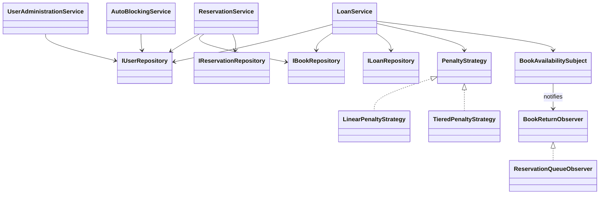

# Діаграма класів (шари та залежності)

```mermaid
classDiagram
  direction TB
  class LoanService
  class ReservationService
  class UserAdministrationService
  class AutoBlockingService
  class IUserRepository
  class IBookRepository
  class ILoanRepository
  class IReservationRepository
  class PenaltyStrategy
  class LinearPenaltyStrategy
  class TieredPenaltyStrategy
  class BookAvailabilitySubject
  class BookReturnObserver

  LoanService --> IUserRepository
  LoanService --> IBookRepository
  LoanService --> ILoanRepository
  LoanService --> PenaltyStrategy
  LoanService --> BookAvailabilitySubject
  ReservationService --> IUserRepository
  ReservationService --> IBookRepository
  ReservationService --> IReservationRepository
  UserAdministrationService --> IUserRepository
  AutoBlockingService --> IUserRepository
  PenaltyStrategy <|.. LinearPenaltyStrategy
  PenaltyStrategy <|.. TieredPenaltyStrategy
  BookReturnObserver <|.. ReservationQueueObserver
  BookAvailabilitySubject --> BookReturnObserver : notifies
```

Реалізації in-memory не показані окремо: вони реалізують відповідні `I*Repository`.
