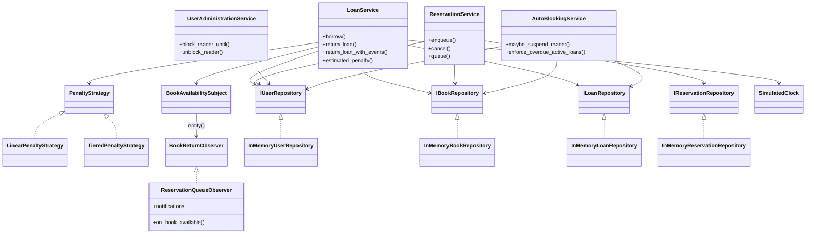

# Діаграма класів (домен і патерни)

```mermaid
classDiagram
  direction TB

  class LoanService {
    +borrow()
    +return_loan()
    +return_loan_with_events()
    +estimated_penalty()
  }
  class ReservationService {
    +enqueue()
    +cancel()
    +queue()
  }
  class UserAdministrationService {
    +block_reader_until()
    +unblock_reader()
  }
  class AutoBlockingService {
    +maybe_suspend_reader()
    +enforce_overdue_active_loans()
  }
  class ReservationQueueObserver {
    +on_book_available()
    +notifications
  }

  class IUserRepository
  class IBookRepository
  class ILoanRepository
  class IReservationRepository
  class PenaltyStrategy
  class LinearPenaltyStrategy
  class TieredPenaltyStrategy
  class BookAvailabilitySubject
  class BookReturnObserver
  class SimulatedClock

  LoanService --> IUserRepository
  LoanService --> IBookRepository
  LoanService --> ILoanRepository
  LoanService --> PenaltyStrategy
  LoanService --> BookAvailabilitySubject
  LoanService --> SimulatedClock
  ReservationService --> IUserRepository
  ReservationService --> IBookRepository
  ReservationService --> IReservationRepository
  UserAdministrationService --> IUserRepository
  AutoBlockingService --> IUserRepository
  AutoBlockingService --> ILoanRepository
  AutoBlockingService --> IBookRepository
  PenaltyStrategy <|.. LinearPenaltyStrategy
  PenaltyStrategy <|.. TieredPenaltyStrategy
  BookReturnObserver <|.. ReservationQueueObserver
  BookAvailabilitySubject --> BookReturnObserver : notify()

  class InMemoryUserRepository
  class InMemoryBookRepository
  class InMemoryLoanRepository
  class InMemoryReservationRepository
  IUserRepository <|.. InMemoryUserRepository
  IBookRepository <|.. InMemoryBookRepository
  ILoanRepository <|.. InMemoryLoanRepository
  IReservationRepository <|.. InMemoryReservationRepository
```

In-memory реалізації (`src/storage/in_memory.py`) приховані за інтерфейсами `I*Repository` — сервіси не залежать від конкретного сховища.
