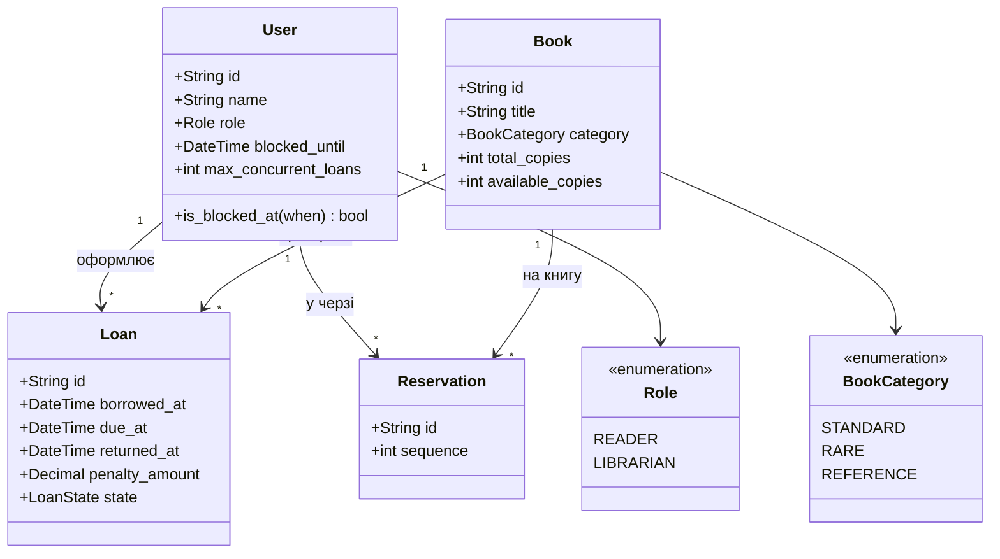

# Модель предметної області

Категорія книги (`STANDARD`, `RARE`, `REFERENCE`) впливає на розрахунок штрафу в патерні **Strategy**.  
`REFERENCE` не видаються назовні. Ліміт одночасних позик задається полем `max_concurrent_loans`.
