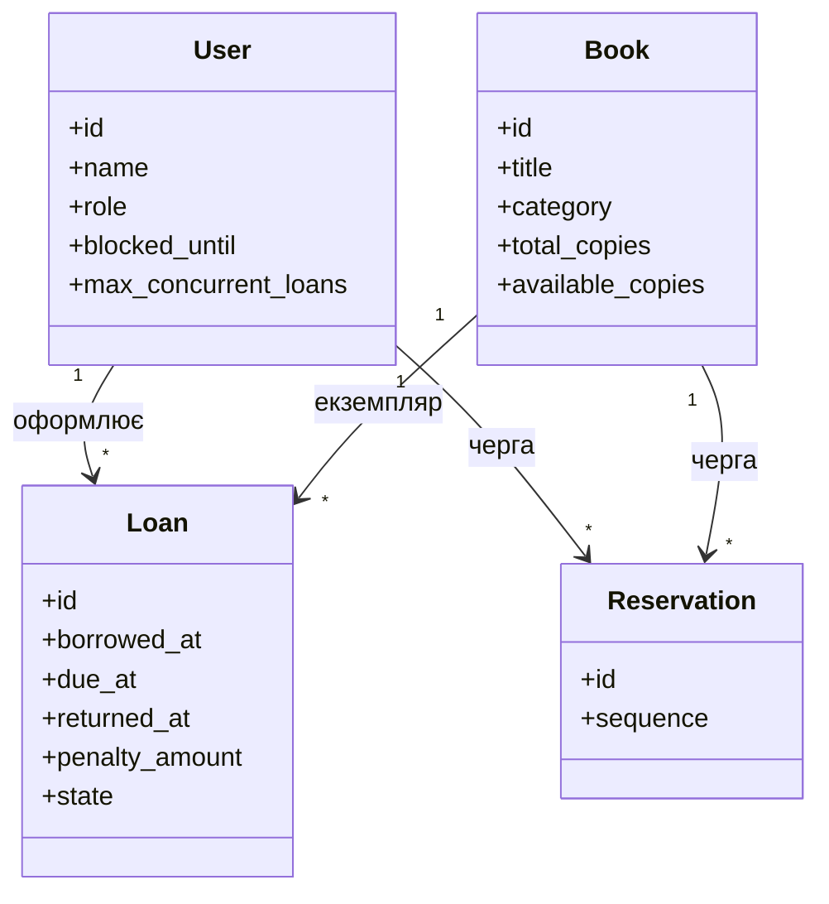

# Модель предметної області (концептуально)

```mermaid
classDiagram
  class User {
    +id
    +name
    +role
    +blocked_until
    +max_concurrent_loans
  }
  class Book {
    +id
    +title
    +category
    +total_copies
    +available_copies
  }
  class Loan {
    +id
    +borrowed_at
    +due_at
    +returned_at
    +penalty_amount
    +state
  }
  class Reservation {
    +id
    +sequence
  }
  User "1" --> "*" Loan : оформлює
  Book "1" --> "*" Loan : екземпляр
  User "1" --> "*" Reservation : черга
  Book "1" --> "*" Reservation : черга
```

Категорія книги впливає на коефіцієнти штрафу в **Strategy**.
