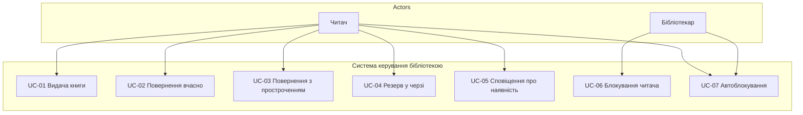

# Діаграма прецедентів (Use Case)

```mermaid
flowchart TB
  subgraph Actors
    R[Читач]
    L[Бібліотекар]
  end
  subgraph System[Система керування бібліотекою]
    UC1[UC-01 Видача книги]
    UC2[UC-02 Повернення вчасно]
    UC3[UC-03 Повернення з простроченням]
    UC4[UC-04 Резерв у черзі]
    UC5[UC-05 Сповіщення про наявність]
    UC6[UC-06 Блокування читача]
    UC7[UC-07 Автоблокування]
  end
  R --> UC1
  R --> UC2
  R --> UC3
  R --> UC4
  R --> UC5
  L --> UC6
  R --> UC7
  L --> UC7
```

Зв’язок **UC-07**: автоблокування може ініціюватись системою після повернення; бібліотекар контролює ручне блокування (**UC-06**).
