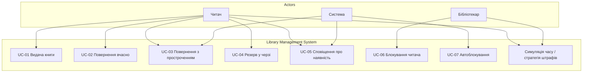

# Діаграма прецедентів (Use Case)

**UC-07** ініціюється системою при прострочених позиках (після перемотки часу або повернення зі штрафом).  
**UC-06** — лише бібліотекар; читач не може заблокувати себе.  
**UC-08** — панель симулятора в веб-UI: перемотка `SimulatedClock`, вибір Linear/Tiered Strategy.
